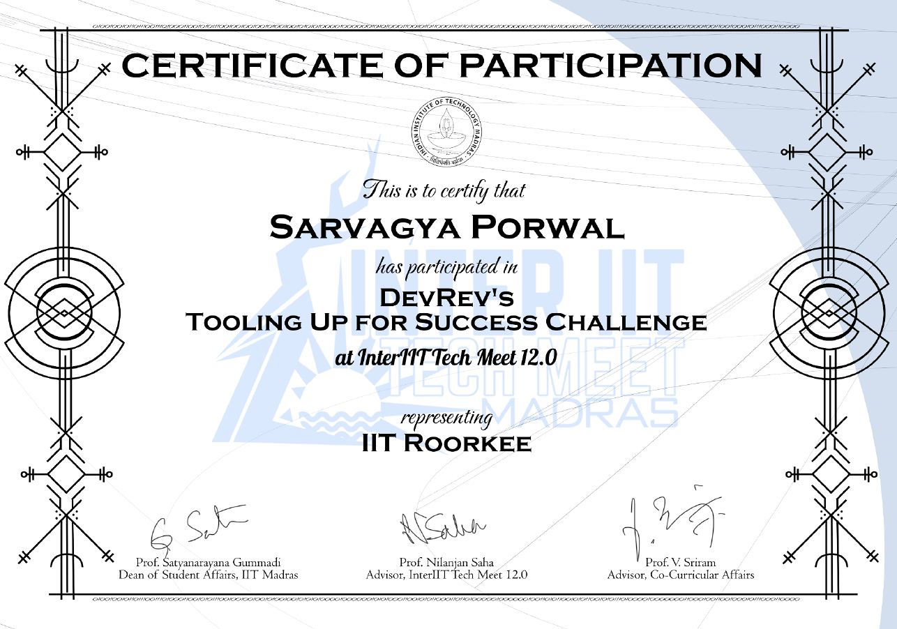

<!-- ---
title: "AI Agent 007: Tooling up for Success"
excerpt: "Self-reflective ReAct agent for autonomous tool allocation and parameter extraction.   "
collection: portfolio
date: 2023-12-20
---

### 🏆 Achievement
**Secured Rank 3** in the *Tooling up for Success* challenge at **Inter-IIT Techfest 2023**. Competing in the DevRev AI Agent Track against top Indian technical institutes, our solution excelled in autonomous tool management.

### 🤖 The Challenge
The objective was to build a "query-aware" agent capable of intelligently allocating tasks to specific tools and reviewing their outputs without human intervention.

### 🧠 Architecture: Self-Reflective ReAct
I implemented a **ReAct (Reason + Act) style agent** that operates in a loop:
1.  **Thought:** The agent analyzes the user query to understand intent.
2.  **Tool Allocation:** It autonomously selects the correct tool for the job (e.g., parameter extraction, API calls).
3.  **Reflection:** The agent reviews the tool's output to ensure accuracy before generating the final response.
4.  **Data Curation:** We curated a custom dataset based on specific tool descriptions to fine-tune the agent's decision-making capabilities.

### 🔗 Links
* [**View Code on GitHub**](#) * [**Competition Leaderboard**](#) ---

### 📸 Visual Library
*Agent decision flowcharts, terminal logs of "Thought-Act-Observation" loops.*

    
      
        
      
    

 -->

---
title: "AI Agent 007: Autonomous Agent with DAG Execution"
excerpt: "<b>Rank 3 @ Inter-IIT Techfest.</b>   Self-improving ReAct agent featuring DAG-based query decomposition and RAG-driven long-term memory.   "
collection: portfolio
date: 2023-12-20
---

### 🏆 Achievement
**Secured Rank 3** in the *Tooling up for Success* challenge at **Inter-IIT Techfest 2023**. Competing in the DevRev AI Agent Track against top Indian technical institutes, our solution excelled in autonomous tool management and complex query resolution.

### 🤖 The Challenge
The objective was to build a "query-aware" agent capable of intelligently allocating tasks to specific tools and reviewing their outputs without human intervention. The core difficulty lay in handling multi-step dependencies and preventing the agent from repeating past logic errors.

### 🧠 Architecture: Advanced Reasoning & Memory

We moved beyond simple linear chains to create a robust, self-correcting system:

#### 1. Graph-Based Query Decomposition
Instead of processing tokens linearly, the agent parses complex user queries into a **Directed Acyclic Graph (DAG)**.
* **Topological Execution:** Tasks are executed in a dependency-aware order.
* **Context Linking:** The output of a *parent query* is automatically passed as context to the *child query*, ensuring seamless data flow across multi-step reasoning.

#### 2. Robust ReAct with Critique & Fallback
I implemented a modified **ReAct (Reason + Act)** loop designed for resilience:
* **Critique Module:** After every tool execution, the agent critiques the output quality.
* **Fallback Mechanism:** If a tool returns unsatisfactory results, the agent triggers specific fallback routines rather than hallucinating an answer.

#### 3. Self-Reflection via RAG (Long-Term Memory)
To prevent the agent from making the same mistake twice, we engineered a "Self-Reflective Pipeline":
* **Experience Retrieval:** The system uses **RAG (Retrieval-Augmented Generation)** to access a long-term memory store of past execution logs.
* **Error Avoidance:** Before taking action, the agent searches for similar past failure scenarios and adjusts its prompt strategy dynamically to avoid repeating those specific mistakes.

### 🔗 Links
* [**View Code on GitHub**](https://github.com/Sar2580P/Dev-Rev-Inter-IIT)

---

### 📸 Visual Library
*Agent decision flowcharts, DAG visualization, and terminal logs of "Thought-Act-Observation" loops.*

    
      
        
      
    

